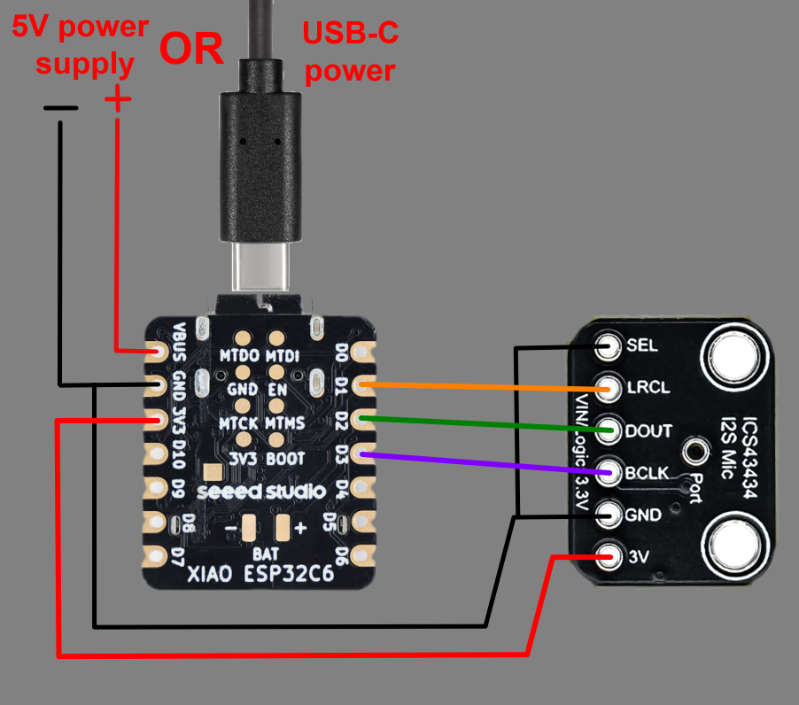

<p align="center">
  
</p>

# birdnet-esp32-rtsp-mic

Seeed XIAO ESP32 network microphone for **BirdNET-Go** and **BirdNET-Pi**. It reads an I2S MEMS
microphone and serves mono **16-bit PCM/L16** audio over **RTSP**.

- Latest firmware: **v1.10.0** (2026-06-11)
- Target sketch: `esp32-birdnet-mic`
- Web flasher: **https://esp32mic.msmeteo.cz** (Chrome/Edge desktop, USB-C data cable)
- Manual OTA firmware: `manual-ota-firmware/firmware-app-<board>.bin` (`firmware-app.bin` remains the C6 alias)
- Detailed firmware docs: `esp32-birdnet-mic/README.md`
- Changelog: `esp32-birdnet-mic/CHANGELOG.md`
- License: MIT (`LICENSE`)

## Quick Start

1. Open **https://esp32mic.msmeteo.cz**.
2. Click **Flash**, select the USB JTAG/serial device, and wait for reboot.
3. On first boot, connect to Wi-Fi AP **ESP32-RTSP-Mic-AP**.
4. Open `http://192.168.4.1` if the captive portal does not appear, then enter your Wi-Fi details.
5. After reboot, open the device Web UI at `http://<device-ip>/`.
6. Use these RTSP URLs in BirdNET-Go, BirdNET-Pi, VLC, or ffplay:

```text
rtsp://<device-ip>:8554/audio1    Stream 1
rtsp://<device-ip>:8554/audio2    Stream 2
```

If mDNS is enabled and works on your LAN, the same streams are available through the device hostname:

```text
rtsp://<device-hostname>.local:8554/audio1
rtsp://<device-hostname>.local:8554/audio2
```

The default hostname is unique per device, for example `esp32mic-a1b2c3`.

Supported XIAO boards:

- [Seeed Studio XIAO ESP32-C3](https://www.seeedstudio.com/Seeed-XIAO-ESP32C3-p-5431.html)
- [Seeed Studio XIAO ESP32-S3](https://www.seeedstudio.com/XIAO-ESP32S3-p-5627.html)
- [Seeed Studio XIAO ESP32-C5](https://www.seeedstudio.com/Seeed-Studio-XIAO-ESP32C5-p-6609.html)
- [Seeed Studio XIAO ESP32-C6](https://www.seeedstudio.com/Seeed-Studio-XIAO-ESP32C6-p-5884.html)

Default build notes:

- The web flasher detects the connected ESP chip family and selects the matching firmware.
- XIAO ESP32-C6 external antenna RF switch is enabled by default.
- XIAO ESP32-C3, XIAO ESP32-S3, and XIAO ESP32-C5 use their U.FL antenna path without firmware GPIO switching.
- OTA has no password in the default public build. Keep the device on your trusted LAN.
- For OTA without USB, open **https://esp32mic.msmeteo.cz**, enter the device IP in the OTA section,
  and open the device update page.
- For manual OTA upload, use the matching app-only file from `manual-ota-firmware/`.

## Wiring

Tested build targets: **Seeed Studio XIAO ESP32-C3/S3/C5/C6**. Runtime hardware validation is still
primarily on **XIAO ESP32-C6** + **ICS-43434** I2S microphone.



Use the same physical XIAO pin labels on every supported board. The underlying GPIO numbers differ
by chip.

| Mic signal | XIAO pin label | C3 GPIO | S3 GPIO | C5 GPIO | C6 GPIO | Notes |
|---|:--:|:--:|:--:|:--:|:--:|---|
| **BCLK / SCK** | **D3** | 5 | 4 | 7 | 21 | I2S bit clock |
| **LRCLK / WS** | **D1** | 3 | 2 | 0 | 1 | I2S word select |
| **SD / DOUT** | **D2** | 4 | 3 | 25 | 2 | I2S data from microphone |
| **VDD** | 3V3 | - | - | - | - | Power |
| **GND** | GND | - | - | - | - | Ground |

**INMP441** has also been reported to work with the same I2S pins. If your board exposes `L/R` or
`SEL`, set it to the left channel, usually GND, because the firmware reads the left I2S channel.
See discussion #25: https://github.com/Sukecz/esp32-birdnet-mic/discussions/25

## XIAO Antennas

XIAO ESP32-C6 uses an RF switch path controlled by GPIO3/GPIO14. The firmware selects the external
antenna path by default.

- Use a 2.4 GHz external antenna for stable RTSP streaming.
- XIAO ESP32-C3 and XIAO ESP32-S3 expose a U.FL antenna connector without a documented firmware GPIO
  switch.
- XIAO ESP32-C5 has a dedicated Wi-Fi/BT antenna connector; attach the included antenna before use.
- Weak Wi-Fi can cause packet loss, retries, and extra heat.
- If your hardware intentionally uses the internal antenna path, adjust or remove the GPIO3/GPIO14
  antenna-control block in `setup()` for the C6 build.

## Test The Stream

Use `/audio1` for stream 1 unless you specifically need the old `/audio` URL.

```bash
ffplay -rtsp_transport tcp rtsp://<device-ip>:8554/audio1
ffprobe -rtsp_transport tcp rtsp://<device-ip>:8554/audio1
```

For VLC: *Media* -> *Open Network Stream* -> paste `rtsp://<device-ip>:8554/audio1` or
`rtsp://<device-ip>:8554/audio2`.

If VLC/ffplay works, use the same RTSP URL in BirdNET-Go or BirdNET-Pi.

## What The Firmware Provides

- English Web UI on port **80** with live status, settings, logs, and actions.
- JSON API for automation and monitoring.
- Two RTSP streams: `/audio1` and `/audio2`; `/audio` is an alias for `/audio1`.
- Configurable **1-3 concurrent RTSP sessions**; default is 2.
- Per-stream enable/disable and BirdNET-Go / BirdNET-Pi target selection.
- Transport selection based on target: TCP for BirdNET-Go, UDP for BirdNET-Pi.
- Dedicated audio producer task with ring buffer between I2S capture and RTSP packet output.
- Audio/API diagnostics for I2S errors, ring-buffer drops, and RTSP write stalls/timeouts.
- MQTT telemetry and Home Assistant MQTT Discovery.
- Stream schedule by local time, including overnight windows.
- Optional deep sleep outside the stream schedule window.
- Auto-recovery, scheduled reset, CPU frequency control.
- Thermal protection with persistent latch and manual acknowledgement.
- Configurable high-pass filter for low-frequency rumble.
- mDNS hostname support and OTA support.

Default audio settings are 48 kHz, mono 16-bit PCM/L16, gain 1.2, and a 512-sample packet buffer.
The 512-sample default is the balanced profile and avoids the BirdNET-Pi UDP stutter observed with
1024-sample packets, while still working well for BirdNET-Go TCP. Firmware v1.9.3 and later improves
BirdNET-Pi UDP compatibility by handling RTCP and RTP metadata expected by ffmpeg-based clients.

## Recommended Hardware

| Part | Qty | Notes | Link |
|---|---:|---|---|
| Seeed Studio XIAO ESP32-C3 | 1 | Supported XIAO target board | [Seeed Studio](https://www.seeedstudio.com/Seeed-XIAO-ESP32C3-p-5431.html) |
| Seeed Studio XIAO ESP32-S3 | 1 | Supported XIAO target board | [Seeed Studio](https://www.seeedstudio.com/XIAO-ESP32S3-p-5627.html) |
| Seeed Studio XIAO ESP32-C5 | 1 | Supported XIAO target board | [Seeed Studio](https://www.seeedstudio.com/Seeed-Studio-XIAO-ESP32C5-p-6609.html) |
| Seeed Studio XIAO ESP32-C6 | 1 | Supported XIAO target board | [Seeed Studio](https://www.seeedstudio.com/Seeed-Studio-XIAO-ESP32C6-p-5884.html) |
| MEMS I2S microphone **ICS-43434** | 1 | Tested reference microphone | [AliExpress](https://www.aliexpress.com/item/1005008956861273.html) |
| MEMS I2S microphone **INMP441** | 1 | Reported compatible with same wiring | - |
| Shielded cable, 5+ core | Optional | I2S mic needs 5 conductors: 3V3, GND, BCLK, LRCLK/WS, and SD/DOUT. A 6-core cable is a good practical choice for spare/shield handling. | [AliExpress](https://www.aliexpress.com/item/1005010375728700.html) |
| 5 V power supply | 1 | At least 1 A recommended | [AliExpress](https://www.aliexpress.com/item/1005002624537795.html) |
| 2.4 GHz antenna, IPEX/U.FL | Recommended | Important for stable XIAO Wi-Fi streaming | [AliExpress](https://www.aliexpress.com/item/1005005439361093.html) |

Links are examples only. Verify the exact part number before buying.

## Practical Tips

- Keep I2S wires short; use shielded cable for longer runs.
- Keep the microphone and I2S wires away from the ESP32 antenna/RF area.
- Aim for Wi-Fi RSSI better than about **-75 dBm**.
- Use DHCP reservation or fixed IP if BirdNET cannot resolve mDNS reliably.
- Keep the device on a trusted LAN; do not expose HTTP/RTSP to the public internet.

### RF Noise / Wi-Fi TX Power

If the stream is stable but the audio is noisy or distorted, try lowering **Wi-Fi TX Power** in the
Web UI. When the access point is nearby, lower TX power can reduce RF coupling into the microphone,
wiring, or power rails.

Suggested test:

1. Set Wi-Fi TX Power to about **11 dBm**.
2. Watch RSSI, packet rate, reconnects, and audio quality for a few minutes.
3. If Wi-Fi becomes unstable, raise TX power step by step.

A grounded metal enclosure can help shield microphone wiring, but keep the Wi-Fi antenna outside the
metal enclosure.

### High-Pass Filter

The firmware includes a configurable high-pass filter to reduce low-frequency rumble.

- Default: ON at 500 Hz.
- Typical range: 300-800 Hz.
- Web UI: Audio -> `High-pass` and `HPF Cutoff`.
- API: `POST /api/set` with `key=hp_enable&value=on|off` or `key=hp_cutoff&value=600`.
- Mutating API calls require header `X-ESP32MIC-CSRF: 1`.

## Compatibility

- Target boards: [Seeed Studio XIAO ESP32-C3](https://www.seeedstudio.com/Seeed-XIAO-ESP32C3-p-5431.html),
  [XIAO ESP32-S3](https://www.seeedstudio.com/XIAO-ESP32S3-p-5627.html),
  [XIAO ESP32-C5](https://www.seeedstudio.com/Seeed-Studio-XIAO-ESP32C5-p-6609.html), and
  [XIAO ESP32-C6](https://www.seeedstudio.com/Seeed-Studio-XIAO-ESP32C6-p-5884.html).
- Web flasher auto-selects firmware by ESP chip family. It cannot distinguish board variants that
  share the same chip family.
- Reference microphone: ICS-43434.
- Reported compatible microphone: INMP441 with the same I2S wiring.
- Other ESP32 boards or I2S microphones may work, but may need pin or I2S format changes.

## Arduino IDE Build Size

Firmware v1.9.2 and later includes `esp32-birdnet-mic/build_opt.h`, which the ESP32 Arduino core loads
automatically in Arduino IDE and `arduino-cli`. It disables unused C++ exception/unwind metadata and
keeps the tight XIAO ESP32-C3/C6 default 1.2 MB app partitions below the limit without removing
firmware features.

## More Documentation

- Firmware details, build instructions, API notes: `esp32-birdnet-mic/README.md`
- Manual OTA firmware: `manual-ota-firmware/README.md`
- Web flasher notes: `web-flasher/README.md`
- Firmware changes: `esp32-birdnet-mic/CHANGELOG.md`

## License

This project is released under the MIT License. See `LICENSE`.
